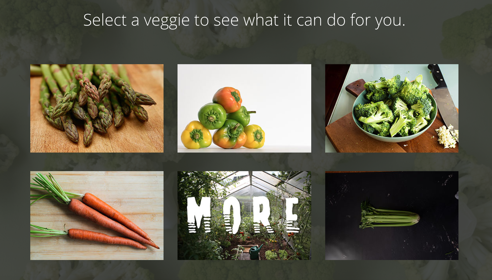

# VEGURU
 ```Understand Your Food```


## Table of Contents
* Description
* Production Team
* How to Use
* Demo Link
* Screenshot
* Additional Questions   

## Description 
Here at veguru, we understand it can be difficult to know what to do with all those wild vegetables out there. I mean what is a beet, right? THat’s why we have created an application to help you find the perfect veggies for you. Whether you are working on a an iron deficiency   or just trying to get your kids to eat more greens, veguru has your back!


## Production Team
* [Alex Eesley ](https://github.com/aeesley)
* [Chris Kalama ](https://github.com/CKalama)
* [Jake Wagner](https://github.com/jkwagneriii)
* [Justin Yocus](https://github.com/jyocus)

## How to Use
When the web page for Veguru loads, take a minute to soak in all the new information pleasantly provided for you and your pals. Scroll around and see what image catches your eye. Once you make your decision, click on the image to find out all the awesome information associated with that veggie! You can even save the veggies you are most interested in to your favorites.

## Demo Links 
[Veguru on Heroku](https://dry-oasis-44384.herokuapp.com/)

[Veguru on Github](https://github.com/aeesley/project-2-veguru)

## Screenshot



## Additional Questions
If you have any questions about the project or would like to contact us, please reach out through GitHub.
